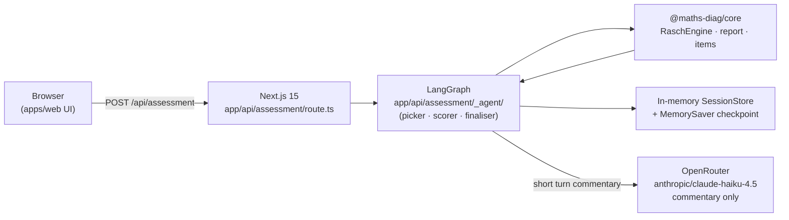
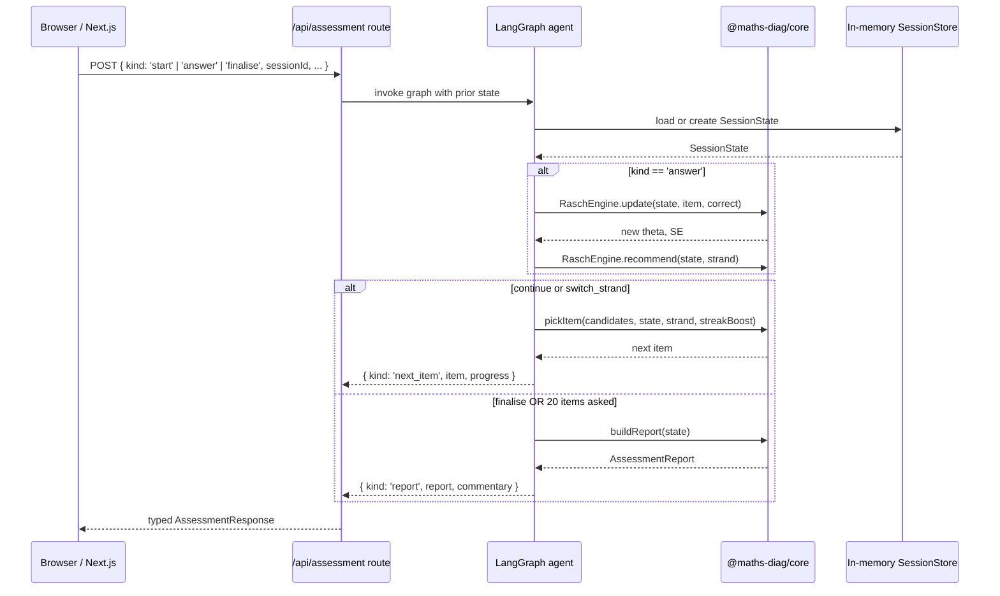

# Irish Maths Diagnostic Agent

Adaptive psychometric assessment for the Irish NCCA Project Maths curriculum.
Built at Zero-to-Agent Dublin (2 May 2026). Classifies a learner's stage
(Primary / Junior Cycle / Leaving Cert), tier (Foundation / Ordinary / Higher),
and per-strand ability across the six NCCA Project Maths strands in 8–12
questions, never more than 20, using the Rasch 1PL model to select each item
and stop when measurement uncertainty is low enough to be useful.

---

## Architecture



The diagnostic loop runs entirely in-process inside the Next.js Node runtime.
The Rasch math (`packages/core`) runs deterministically; the LLM is only
asked to produce one or two encouraging sentences per turn.

A second route, `/api/study-plan`, takes a finalised report plus learner goals
and returns a week-by-week plan via the same LangGraph + OpenRouter wiring.
See `apps/web/app/api/study-plan/_agent/index.ts`.

---

## Sequence: one diagnostic turn



---

## Rasch 1PL Model

The engine implements the one-parameter logistic Rasch model. After each
answer, strand ability updates as `theta_new = theta_old + K * (observed -
expected)` where `expected = sigmoid(theta - b)`, `observed` is 1 (correct)
or 0 (incorrect), and `K = 0.4`. Standard error shrinks as `SE_new =
max(0.25, 1 / sqrt(1 + n))`, flooring at 0.25 after roughly six items per
strand. Each of the six strands carries an independent theta (init 0) and SE
(init 1.0). Stopping rules: emit `switch_strand` when `SE[strand] < 0.4`;
emit `finalise` when four or more of the five active JC strands reach
`SE < 0.4`, or when 20 items have been asked (hard cap). Tier thresholds:
theta below −0.5 → Foundation; −0.5 to 1.0 → Ordinary; above 1.0 → Higher.

A **global trailing streak boost** (±0.5 per consecutive correct/incorrect,
capped at ±1.8) shifts the picker's target `b` between strand rotations so
hot/cold runs reach the edges of the bank in 4–5 questions instead of being
trapped in the b≈0 cluster. See `packages/core/src/rasch-engine.ts:streakBoost`.

---

## Data Model

### `SessionState`

```ts
interface SessionState {
  sessionId: string;
  stageEstimate: Stage | null;          // null until detect-stage runs
  theta: Record<Strand, number>;        // ability per strand, init 0
  se: Record<Strand, number>;           // standard error per strand, init 1.0
  history: Array<{
    itemId: string;
    correct: boolean;
    latencyMs: number;
  }>;
  itemsAsked: Set<string>;
  finalised: boolean;
}
```

### `AssessmentReport`

```ts
interface AssessmentReport {
  stage: Stage;
  overallTier: Tier;                    // median tier across the 5 reported strands
  strands: Record<Strand, {
    theta: number;
    tier: Tier;
    confidence: number;                 // 1 - SE, clamped [0, 1]
  }>;
  strengths: string[];                  // NCCA learning outcome refs: correct & theta > 1.0
  gaps: string[];                       // NCCA learning outcome refs: wrong & theta < -0.5
  nextSteps: string;                    // templated, deterministic; no LLM involvement
}
```

### Enums

```ts
type Stage  = 'primary' | 'junior_cycle' | 'leaving_cert';
type Strand = 'number' | 'algebra' | 'geometry_trig'
            | 'functions' | 'statistics_prob' | 'measures_data';
type Tier   = 'foundation' | 'ordinary' | 'higher';
type Recommendation = 'continue' | 'switch_strand' | 'finalise';
```

`measures_data` is a primary-stage strand — excluded from the active-strand
count and `AssessmentReport` for Junior Cycle and Leaving Cert sessions.

---

## Item Bank

`packages/core/src/items.ts` inlines the canonical MCQ bank covering the
Junior Cycle and Leaving Cert strands at Foundation, Ordinary, and Higher
difficulty (Rasch `b` from −2 to +2). Each item carries `id`, `learningOutcome`
(NCCA code), `b` (Rasch logit difficulty), `text` and four `choices` (LaTeX
preserved), `source: 'anchor'`, and an optional `khanAcademyRef`. KaTeX
rendering happens in the browser, so source items keep their LaTeX intact
through the API.

---

## Session Persistence

Sessions live in process memory inside the Node.js server (`apps/web/app/api/
assessment/_agent/session-store.ts`) keyed by `sessionId`. LangGraph's
`MemorySaver` handles per-turn checkpointing for the graph itself.

This is fine for the demo and a single-replica VPS deploy; if the container
is recycled, in-flight sessions are lost. Replacing the in-memory store with
a Redis or Postgres backend is a one-file change.

---

## Talk artifacts

The project was presented at Zero-to-Agent Dublin. Three companion artifacts
cover the three delivery surfaces — visual triggers on stage, post-talk deep
reading, and the spoken script the talk follows.

| Artifact | Form | Purpose |
|---|---|---|
| [`presentations/irish-maths-diagnostic-pdf/build/presentation.pdf`](./presentations/irish-maths-diagnostic-pdf/build/presentation.pdf) | 19-page A4 PDF | Presenter trigger sheet — bullets, code excerpts, diagrams; one slide per beat. |
| [`presentations/irish-maths-diagnostic-academic-pdf/build/academic-guide.pdf`](./presentations/irish-maths-diagnostic-academic-pdf/build/academic-guide.pdf) | 58-page A4 PDF | Long-form academic deep-dive — full code listings, alternatives, exercises, bibliography. |
| [`presentations/irish-maths-diagnostic-script/SCRIPT.md`](./presentations/irish-maths-diagnostic-script/SCRIPT.md) | Markdown | The spoken script — hybrid word-for-word + speaker notes; cross-references the presenter PDF. |

Cue card and Q&A bank live alongside the script in
[`presentations/irish-maths-diagnostic-script/notes/`](./presentations/irish-maths-diagnostic-script/notes/).

---

## Local Development

### Prerequisites

- Node.js 20+
- pnpm 9+

### Install

```bash
pnpm install
```

### Run core tests

```bash
pnpm --filter @maths-diag/core test
```

### Run the web app

```bash
cp apps/web/.env.local.example apps/web/.env.local
# edit apps/web/.env.local: set OPENROUTER_API_KEY
pnpm --filter web dev
```

Open `http://localhost:3000`. Assessment UI at `/assessment`; debug smoke
harness at `/assessment/smoke`.

### Environment variables

| Variable | Required | Description |
|---|---|---|
| `OPENROUTER_API_KEY` | Yes | https://openrouter.ai → Account → Keys |
| `OPENROUTER_MODEL` | No | Defaults to `anthropic/claude-haiku-4.5` |

---

## Deploying the Web UI

The Next.js UI deploys as a single Docker container bound to `127.0.0.1:8088`
on a shared Hetzner VPS. The host's existing nginx terminates TLS via a
shared Cloudflare Origin Cert for `*.andriybabiy.com` and proxies to the
container — same pattern as the other tenants on the box (`studyie`,
`movie-generator`, `teamwork-board`). See [DEPLOY.md](./DEPLOY.md) for the
full runbook.

---

## Project Structure

```
zero-to-agent/
├── pnpm-workspace.yaml
├── apps/
│   └── web/                                       # Next.js 15 UI
│       ├── .env.local.example
│       └── app/
│           ├── page.tsx                            # Landing
│           ├── assessment/page.tsx                 # Three-pane workbook
│           ├── results/page.tsx                    # Report view
│           └── api/
│               ├── assessment/
│               │   ├── route.ts                    # HTTP route
│               │   └── _agent/                     # LangGraph picker/scorer
│               └── study-plan/
│                   ├── route.ts
│                   └── _agent/                     # LangGraph plan generator
└── packages/
    └── core/                                       # @maths-diag/core
        └── src/
            ├── types.ts
            ├── rasch-engine.ts                     # 1PL update, picker, recommend
            ├── report.ts                           # Pure report builder
            ├── items.ts                            # MCQ bank
            ├── session-store.ts                    # In-memory store
            ├── stage-router.ts                     # Initial-stage classifier
            ├── study-plan-priorities.ts            # Strand prioritisation
            └── study-plan-types.ts
```

---

## Known limitations

- Sessions are in-memory only — recycling the container drops them.
- `apps/web/app/api/assessment/types.ts` deliberately mirrors
  `packages/core/src/types.ts` rather than importing the workspace package,
  for typecheck resilience. The two files must be kept in sync manually if
  core types change.

---

## License

MIT.
