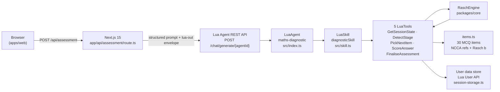
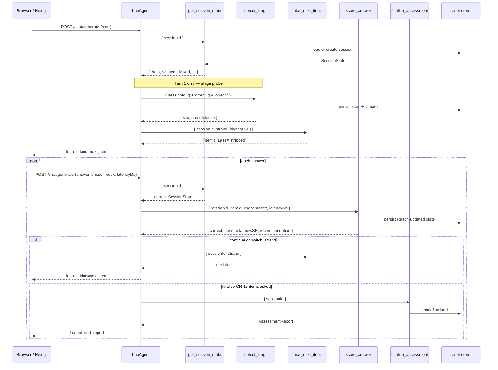

# Irish Maths Diagnostic Agent

Adaptive psychometric assessment for the Irish NCCA Project Maths curriculum. Built at Zero-to-Agent Dublin (2 May 2026), competing simultaneously on Lua Track 2 (AI agent with Rasch psychometrics) and Next.js Track 1 (web UI). The agent classifies a learner's stage (Primary / Junior Cycle / Leaving Cert), tier (Foundation / Ordinary / Higher), and per-strand ability across six NCCA Project Maths strands in 8–12 questions, never more than 15, using the Rasch 1PL model to select each item and stop when measurement uncertainty is low enough to be useful.

---

## Architecture



---

## Sequence: one diagnostic turn



---

## The 5 Tools

| Tool | When called | Input schema | Output |
|---|---|---|---|
| `get_session_state` | Start of every turn. Idempotent: creates the session if it does not exist. | `{ sessionId: string }` | `{ sessionId, stageEstimate, theta, se, itemsAsked, historyCount, finalised }` |
| `detect_stage` | Turns 1–2 only. Classifies the learner's stage from 1–2 probe answers before adaptive items begin. | `{ sessionId, q1Correct: boolean, q2Correct?: boolean \| null }` | `{ stage: Stage, confidence: number }`. Side-effect: writes `stageEstimate` to the session. |
| `pick_next_item` | After each scored answer (or at session start once stage is known). Selects the item whose Rasch `b` is closest to `theta[strand]`, excluding already-asked items. | `{ sessionId, strand: Strand }` | `{ item: Item }` with LaTeX converted to Unicode/ASCII. Throws if the item bank has no anchor within tolerance for the current (theta, strand) cell. |
| `score_answer` | Immediately after the learner submits an answer. Applies the Rasch 1PL update and persists the new state. | `{ sessionId, itemId: string, chosenIndex: 0\|1\|2\|3, latencyMs: number }` | `{ correct, newTheta, newSE, recommendation: 'continue' \| 'switch_strand' \| 'finalise' }` |
| `finalise_assessment` | When `recommendation == 'finalise'` or 15 items have been asked. Idempotent: rebuilds deterministically from persisted state on repeat calls. | `{ sessionId: string }` | `AssessmentReport` — stage, overall tier (median), per-strand theta/tier/confidence, strengths, gaps, next-steps blurb. |

---

## Rasch 1PL Model

The engine implements the one-parameter logistic Rasch model. After each answer, strand ability updates as `theta_new = theta_old + K * (observed - expected)` where `expected = sigmoid(theta - b)`, `observed` is 1 (correct) or 0 (incorrect), and `K = 0.4`. Standard error shrinks as `SE_new = max(0.25, 1 / sqrt(1 + n))`, flooring at 0.25 after roughly six items per strand. Each of the six strands carries an independent theta (init 0) and SE (init 1.0). Stopping rules: emit `switch_strand` when `SE[strand] < 0.4`; emit `finalise` when four or more of the five active JC strands reach `SE < 0.4`, or when 15 items have been asked (hard cap). Tier thresholds: theta below −0.5 → Foundation; −0.5 to 1.0 → Ordinary; above 1.0 → Higher.

---

## Data Model

### `SessionState`

```ts
interface SessionState {
  sessionId: string;
  stageEstimate: Stage | null;          // null until detect_stage runs
  theta: Record<Strand, number>;        // ability per strand, init 0
  se: Record<Strand, number>;           // standard error per strand, init 1.0
  history: Array<{
    itemId: string;
    correct: boolean;
    latencyMs: number;
  }>;
  itemsAsked: Set<string>;              // serialised as string[] at storage boundary
  finalised: boolean;
}
```

### `AssessmentReport`

```ts
interface AssessmentReport {
  stage: Stage;
  overallTier: Tier;                    // median tier across the 5 reported strands
  strands: Record<Strand, {
    theta: number;
    tier: Tier;
    confidence: number;                 // 1 - SE, clamped [0, 1]
  }>;
  strengths: string[];                  // NCCA learning outcome refs: correct & theta > 1.0
  gaps: string[];                       // NCCA learning outcome refs: wrong & theta < -0.5
  nextSteps: string;                    // templated, deterministic; no LLM involvement
}
```

### Enums

```ts
type Stage  = 'primary' | 'junior_cycle' | 'leaving_cert';
type Strand = 'number' | 'algebra' | 'geometry_trig'
            | 'functions' | 'statistics_prob' | 'measures_data';
type Tier   = 'foundation' | 'ordinary' | 'higher';
type Recommendation = 'continue' | 'switch_strand' | 'finalise';
```

`measures_data` is a primary-stage strand — excluded from the active-strand count and `AssessmentReport` for Junior Cycle and Leaving Cert sessions.

---

## Item Bank

`apps/lua-agent/src/items.ts` inlines 30 anchor MCQ items covering five Junior Cycle strands at Foundation, Ordinary, and Higher difficulty (Rasch `b` from −2 to +2). Each item carries `id` (slug `jc-{strand_abbr}-{seq}`), `learningOutcome` (NCCA code), `b` (Rasch logit difficulty), `text` and four `choices` (LaTeX preserved in source), `source: 'anchor'`, and an optional `khanAcademyRef`.

Items are inlined as TypeScript rather than loaded from disk because Lua's sandbox executes the compiled bundle via `vm.Script(eval)`, which provides no filesystem access outside the bundle.

---

## Session Persistence

The Lua platform re-evaluates the full agent bundle on every chat turn, resetting all module-level state. An in-memory `SessionStore` therefore cannot survive the turn boundary. `apps/lua-agent/src/session-storage.ts` defines two backends behind a single `SessionStorage` interface: `MemorySessionStorage` (wraps the core `SessionStore`; selected when `process.env.VITEST` is set) and `LuaUserSessionStorage` (production; persists the full `SessionState` as a JSON blob in the Lua `User` API under field `mathsDiagnosticSession`). The User API was chosen over Lua's Custom Data collection because `User.update()` is read-your-writes consistent within the same conversation thread — the Custom Data API's indexing lag produced stale reads immediately after writes during early testing. One session per user is intentional. `Set<string>` (not JSON-serialisable) is round-tripped as an array at the storage boundary.

---

## LaTeX Handling

Items store maths in LaTeX so they remain KaTeX-ready for richer UIs. The heylua.ai chat shell has no KaTeX renderer and displays `$…$` blocks as empty text. `apps/lua-agent/src/latex.ts` provides `stripLatex()`, which converts the patterns present in the JC item bank — `\frac`, `\sqrt`, `^n` exponents (to Unicode superscripts), and operator macros (`\cdot`, `\times`, `\div`, `\pi`, `\theta`, `\le`, `\ge`, `\neq`, `\pm`) — to Unicode or ASCII equivalents. The transform runs inside `pick_next_item` at the tool boundary, keeping source items intact for future rendering environments.

---

## Local Development

### Prerequisites

- Node.js 20+
- pnpm 9+

### Install

```bash
pnpm install
```

### Run agent tests

```bash
pnpm --filter lua-agent test
```

The smoke test (`apps/lua-agent/tests/loop.smoke.test.ts`) walks the full diagnostic loop — `GetSessionState` → `DetectStage` → (`PickNextItem` → `ScoreAnswer`) × N → `FinaliseAssessment` — without an LLM, against the in-memory backend.

### Run the web UI

```bash
cp apps/web/.env.local.example apps/web/.env.local
# edit apps/web/.env.local with LUA_AGENT_ID and LUA_API_KEY
pnpm --filter web dev
```

Open `http://localhost:3000`. Assessment UI at `/assessment`; debug smoke harness at `/assessment/smoke`.

### Environment variables

| Variable | Required | Description |
|---|---|---|
| `LUA_AGENT_ID` | Yes | Agent UUID — matches `agentId` in `apps/lua-agent/lua.skill.yaml` |
| `LUA_API_KEY` | Yes | Personal API key from the heylua.ai dashboard |
| `LUA_API_URL` | No | Defaults to `https://api.heylua.ai` |
| `LUA_CHANNEL` | No | Defaults to `dev`. Set to `web` for production traffic. |

---

## Deploying the Agent to Lua

The agent runs on Lua's platform. No server is needed on your side.

```bash
# 1. Type-check and compile TypeScript
pnpm --filter lua-agent run build

# 2. Compile to the Lua bundle format (run from apps/lua-agent/)
cd apps/lua-agent
npx lua compile

# 3. Push the compiled bundle and auto-deploy to production
npx lua push all --force --auto-deploy
```

`lua push all --force --auto-deploy` uploads the bundle, increments the skill version in `apps/lua-agent/lua.skill.yaml`, and promotes to production in one step. The agent ID is stable across pushes.

To iterate locally without deploying:

```bash
cd apps/lua-agent
npx lua chat          # interactive chat in sandbox mode
npx lua test          # interactive tool-level test harness
```

---

## Deploying the Web UI

The Next.js UI deploys as a single Docker container behind a Caddy reverse proxy on a Hetzner VPS. See [DEPLOY.md](./DEPLOY.md) for the full runbook (DNS, SSH, env, deploy script).

---

## Design Decisions

**In-memory `SessionStore` broke between sandbox turns.** The Lua sandbox resets the Node.js module cache on every chat turn, so `new Map()` at module level is empty at the start of every tool call. The fix was `LuaUserSessionStorage`, which persists state to `User.update()` — read-your-writes consistent for the same conversation, unlike the Custom Data API.

**LaTeX broke the heylua.ai chat UI.** Items were authored with KaTeX-style `$\frac{2}{3}$` markup. The chat shell rendered these as blank lines. `stripLatex()` is applied inside `pick_next_item` at the tool boundary, converting patterns to Unicode/ASCII. Source items remain KaTeX-clean.

**Gemini function-declaration limits rejected union-literal `chosenIndex`.** `score_answer` originally declared `chosenIndex` as `z.union([z.literal(0)…z.literal(3)])`. Gemini's converter rejected the union. The fix: `z.number().int().min(0).max(3)`, a plain JSON Schema integer with bounds.

**`correctIndex` is stripped before the browser receives an item.** `pick_next_item` returns the full `Item` including `correctIndex` so `score_answer` can verify server-side. The Next.js route handler calls `toPublicItem()` before sending the item to the browser.

**Overall tier is the median, not the mean.** `finalise_assessment` sorts the five per-strand tiers by ordinal (F=0, O=1, H=2) and takes the middle entry. Avoids fractional tier interpolation.

**Agent output is extracted from a `<lua-out>` envelope.** The Lua production API exposes only the agent's text reply — tool calls and results are not surfaced to API consumers. The Next.js route injects a structured envelope contract into every turn prompt, instructing the agent to embed its final tool result as `<lua-out>{...}</lua-out>` JSON. The route parses the last occurrence and returns a typed `AssessmentResponse`.

---

## Project Structure

```
zero-to-agent/
├── pnpm-workspace.yaml
├── apps/
│   ├── lua-agent/                     # Lua Track 2 agent
│   │   ├── lua.skill.yaml             # Lua platform manifest (auto-managed)
│   │   ├── tests/loop.smoke.test.ts   # End-to-end loop smoke test (no LLM)
│   │   └── src/
│   │       ├── index.ts               # LuaAgent entry + system prompt
│   │       ├── skill.ts               # LuaSkill wiring 5 tools
│   │       ├── runtime.ts             # Shared singletons
│   │       ├── items.ts               # 30 inlined MCQ items
│   │       ├── latex.ts               # stripLatex()
│   │       ├── session-storage.ts     # Memory / LuaUser backends
│   │       └── tools/
│   │           ├── GetSessionState.ts
│   │           ├── DetectStage.ts
│   │           ├── PickNextItem.ts
│   │           ├── ScoreAnswer.ts
│   │           └── FinaliseAssessment.ts
│   └── web/                           # Next.js 15 Track 1 UI
│       ├── .env.local.example
│       └── app/
│           ├── page.tsx
│           ├── assessment/page.tsx    # Three-pane workbook
│           ├── results/page.tsx       # Report (stub)
│           └── api/assessment/
│               ├── route.ts           # Lua REST bridge + envelope parser
│               └── types.ts           # Wire types mirroring core
└── packages/
    └── core/                          # @maths-diag/core
        └── src/
            ├── types.ts
            ├── rasch-engine.ts
            ├── session-store.ts
            └── stage-router.ts
```

---

## Known limitations

- `apps/web/app/results/page.tsx` is a stub — radar chart and report rendering not yet wired up.
- All 30 items are tagged `stage: 'junior_cycle'`. `measures_data` (a primary-stage strand) has no items; `pick_next_item` will throw "Bank too sparse" if asked for it. JC sessions exclude this strand by design.
- `apps/web/app/api/assessment/types.ts` deliberately mirrors `packages/core/src/types.ts` rather than importing the workspace package, for typecheck resilience. The two files must be kept in sync manually if core types change.
- `LUA_CHANNEL` defaults to `dev`. For live traffic set it to `web` in the deployment environment.

---

## License

MIT.
